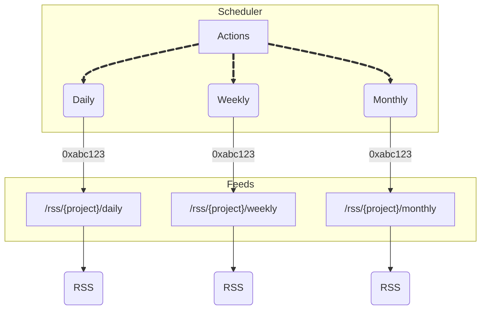

# rss

### Feeds

The following automated feeds are updated daily, weekly, and monthly with new hashes. Replace `{project}` with any of these [generators](https://generator.pxlq.art).

`[0 0 * * *]`  
https://rss.pxlq.art/{project}/daily

`[0 1 * * 0]`  
https://rss.pxlq.art/{project}/weekly

`[0 2 1 * *]`  
https://rss.pxlq.art/{project}/monthly

### Schematic

